# **移动机器人控制与导航作业**

**第一部分：仿真环境搭建**

**作者：**chengxiaoyu

**指导老师：**李庆标 博士（Qingbiao LI）

**课程：**移动机器人控制与导航，澳门大学

## **环境版本**

|          |                                          |
|:--------:|:----------------------------------------:|
| **组件** |                 **版本**                 |
| 操作系统 |    Ubuntu 22.04（WSL2 on Windows 10）    |
|  ROS 2   |             Humble Hawksbill             |
|  Webots  |                  R2025a                  |
|  Python  |                   3.10                   |
|  仿真包  | webots_ros2_robomaster（MohismLab fork） |

## **启动命令**

### **启动仿真**

> source /opt/ros/humble/setup.bash
>
> source ~/ros2_ws/install/setup.bash
>
> ros2 launch webots_ros2_robomaster robot_launch.py

### **键盘控制机器人（另开终端）**

> source /opt/ros/humble/setup.bash
>
> source
> ~/ros2_ws/install/setup.bash(注：每个新终端都要先执行这两条source命令，创建环境）
>
> python3
> ~/ros2_ws/src/webots_ros2_robomaster/webots_ros2_robomaster/keyboard_twist.py
> --topic /agent0/cmd_vel

**按键说明：**W 前进 / S 后退 / A 左转 / D 右转 / Q、E 旋转 / 空格 停止
/ c 退出

> *⚠️
> 运行键盘节点时，必须点击该终端窗口使其获得焦点，再按键，否则输入无法被程序接收。*

## **环境问题及解决方案**

### **问题 1：ROS 2 apt 源添加失败**

**现象：**\`sudo apt install ros-humble-desktop\` 返回 \`0 newly
installed\`，ros2 命令找不到。

**原因：**复制粘贴多行命令时，\`echo "deb ..."\` 中的 \`\\
换行符未正确处理，源文件未创建。

**解决：**分步执行，单独运行 curl和echo 命令，重新添加
/etc/apt/sources.list.d/ros2.list。

### **问题 2：C 盘空间不足导致安装中断**

**现象：**ROS 2 安装或文件解压过程中报 \`disk full\`，WSL
文件系统变为只读。

**解决：**使用 360清理Pro 清理垃圾文件（约 3.2 GB），重启 WSL（\`wsl
--shutdown\`）后恢复读写，重新安装。

### **问题 3：Windows 10 WSL2 无图形界面支持**

**现象：**在 WSL 中运行 GUI 程序（如 Webots、xclock）无窗口弹出。

**原因：**Windows 10 的 WSL2 不内置 WSLg 图形支持（Windows 11 才有）。

**解决：**

1\. 安装 VcXsrv（https://sourceforge.net/projects/vcxsrv/），启动时勾选
Disable access control

2\. 在 WSL 中设置 DISPLAY 变量：

> export DISPLAY=\$(cat /etc/resolv.conf \| grep nameserver \| awk
> '{print \$2}'):0.0
>
> echo 'export DISPLAY=\$(cat /etc/resolv.conf \| grep nameserver \| awk
> \\{print \$2}\\):0.0' \>\> ~/.bashrc

### **问题 4：webots_ros2_robomaster 编译失败（缺少 Orin.dae 网格文件）**

**现象：**\`colcon build\` 报 \`can't copy 'protos/meshes/Orin.dae':
doesn't exist\`。

**原因：**仓库使用 Git LFS 存储大型 3D 模型文件，且依赖
download_protos.sh 从 Google Drive 下载 proto 文件。

**解决：**

1\. 安装 git-lfs 并拉取：

> git lfs install && git lfs pull

2\. 安装 gdown 并执行下载脚本：

> pip3 install gdown
>
> bash download_protos.sh

3\. 若 Google Drive 访问超时，在 Windows 浏览器手动下载 zip 包，解压到
webots_ros2_robomaster/protos/

### **问题 5：Windows 端口被 Hyper-V 占用（端口 1234-1244 全部保留）**

**现象：**Webots 报 \`failed to open TCP server in the port range
\[1234-1244\]\`，ROS 2 控制器连不上 Webots。

**原因：**WSL2 底层的 Hyper-V 会随机保留一段端口供内部使用，端口
1234-1244 落在保留区间内。

**解决：**在管理员 PowerShell 中执行：

> net stop winnat
>
> net start winnat

### **问题 6：Webots 自动安装版本存在 DLL 错误（Qt6Qml.dll）**

**现象：**\`ros2 launch\` 自动下载安装的 Webots R2025a 报
\`无法定位程序输入点 ... 于 Qt6Qml.dll\`，仿真无法正常运行。

**原因：**自动安装包中的 Qt6Qml.dll 与主程序存在 libstdc++
版本不兼容问题。

**解决：**从 GitHub
Releases（https://github.com/cyberbotics/webots/releases/tag/R2025a）手动下载
webots-R2025a_setup.exe 并重新安装。

### **问题 7：仿真时间卡在 0（synchronization TRUE 导致死锁）**

**现象：**Webots 窗口打开但时间一直为 \`0:00:00:000\`，控制器在
connected/disconnected 间循环，机器人无响应。

**原因：**Webots 默认 \`synchronization TRUE\`，要求所有 extern
控制器同时连接后才推进物理仿真。由于两个控制器轮流重连，始终无法同时在线，仿真因此永远无法启动。

**解决：**在 worlds/break_room.wbt 的两个 Robot 节点中，在 \`controller
"\<extern\>"\` 后各添加一行：

> synchronization FALSE

### **问题 8：sensing_msgs 自定义消息包未被 colcon 识别**

**现象：**控制器崩溃，报 \`ModuleNotFoundError: No module named
'sensing_msgs'\`，仿真中控制器持续断线重连。

**原因：**\`sensing_msgs\` 是 \`webots_ros2_robomaster\`
的子目录包，colcon 在父包存在 package.xml 的情况下未能递归发现该子包。

**解决：**将其复制到工作空间 src/ 根目录后单独编译：

> cp -r ~/ros2_ws/src/webots_ros2_robomaster/sensing_msgs ~/ros2_ws/src/
>
> cd ~/ros2_ws && colcon build --packages-select sensing_msgs
>
> source install/setup.bash

1.  截图 A — \`ros2 launch webots_ros2_robomaster robot_launch.py\`
    启动后，终端显示各控制器 \`connected\` 的日志

>  src="assets/readme_media/media/image1.png"
> style="width:5.73611in;height:3.24861in" alt="IMG_256" />

2.  截图 B — Webots 仿真界面，时间在运行，两个机器人可见

    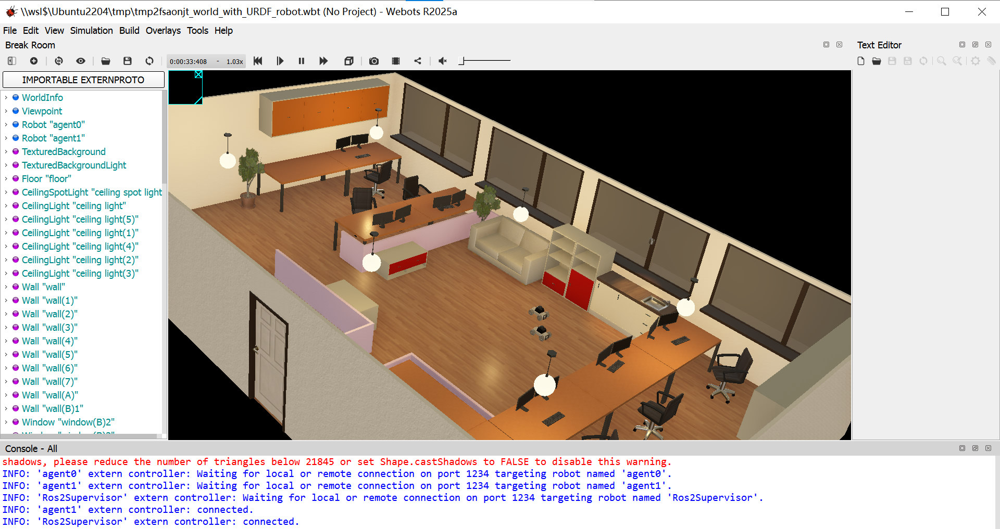

3.  截图 C — 键盘控制节点终端，显示 \`Use keys: \[W\] forward, \[S\]
    back, \[A\] left, \[D\] right...\`

    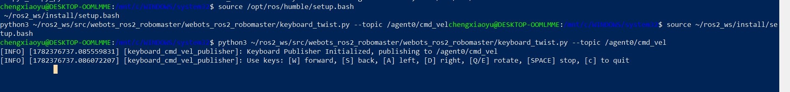

    4.仿真界面和视频 **—** 运行键盘控制后，Webots
    视角变化表明机器人已移动

    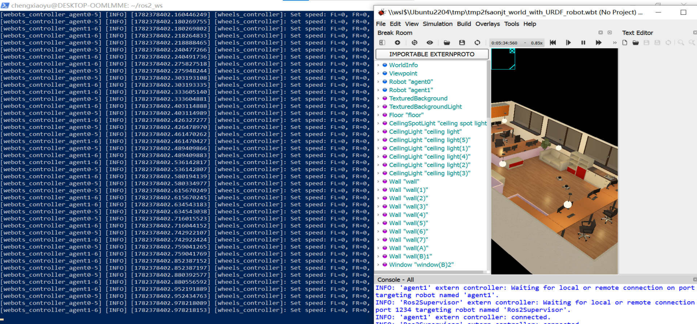

[演示视频：Webots 仿真与键盘控制](videos/Part1_Webots_keyboard_control_demo.mp4)

**第二部分：基于 PID 控制的点到点导航**

**任务概述**

本部分要求为移动机器人实现 PID
控制器，使其能自主从起始位置移动到环境中指定的目标点。需要设计独立 PID
回路，订阅位姿话题获取当前状态，发布速度指令驱动机器人，并满足一定的稳态精度（位置误差小于设定阈值）。要求至少测试
2-3 组不同目标点，并展示轨迹与误差曲线。

**运动学模型与控制方案**

**运动学模型确认：**

通过对 webots_ros2_robomaster
仿真包源码的分析与实测验证，确认本机器人采用麦克纳姆轮全向底盘。实测按下
A/D 键时机器人可横向平移（linear.y 有效），表明机器人具备 3
个自由度：前向平移 (vx)、横向平移 (vy)、原地旋转
(ω)。这与差速驱动底盘有本质区别——全向底盘可以朝任意方向平移而不必先转向。

**控制策略：位置-朝向解耦控制**

基于全向底盘特性，采用三个独立 PID 回路进行解耦控制：

\(1\) 前向回路 (vx)：控制机器人坐标系下的前向速度，消除前方位置误差

\(2\) 横向回路 (vy)：控制横向速度，消除左侧位置误差

\(3\) 旋转回路 (ω)：控制角速度，消除朝向误差（可选，未指定目标朝向时为
0）

**坐标变换：**

由于目标点坐标在世界坐标系下给出，而机器人只理解自身坐标系（前后左右），需要将世界系误差向量通过旋转矩阵转换到机器人坐标系：

> \# 世界系误差 -\> 机器人坐标系（theta 为当前朝向）  
> ex_r = ex_w \* cos(theta) + ey_w \* sin(theta) \# 前方误差  
> ey_r = -ex_w \* sin(theta) + ey_w \* cos(theta) \# 左侧误差

该变换确保无论机器人面朝何方，都能正确解算出目标相对于自身的方位，从而实现直线直达（无需先转身再前进），轨迹最短。

**位姿反馈来源：GPS + Compass**

由于仿真环境中 diffdrive_controller 未激活，/agent0/odom
话题无数据发布。经排查发现 Webots 仿真器原生提供 GPS 和罗盘传感器：

/agent0/gps (geometry_msgs/PointStamped)：直接给出世界坐标系真值 (x,
y)，约 20Hz，无累积误差

/agent0/compass/bearing
(webots_ros2_msgs/FloatStamped)：给出朝向角度（度数，0°=东，逆时针为正），约
18Hz

采用 GPS+Compass
作为位姿源比轮速积分里程计更精确，是一种更优的反馈方案。

**PID 控制器设计**

三个 PID 回路的参数配置如下：

|          |               |           |          |        |        |        |
|:--------:|:-------------:|:---------:|:--------:|:------:|:------:|:------:|
| **回路** | **输入误差**  | **输出**  | **限幅** | **Kp** | **Ki** | **Kd** |
| 前向 vx  | 前方误差 ex_r | vx (m/s)  |  ±0.25   |  0.8   |  0.0   |  0.05  |
| 横向 vy  | 左侧误差 ey_r | vy (m/s)  |  ±0.25   |  0.8   |  0.0   |  0.05  |
|  旋转 ω  | 朝向误差 e_θ  | ω (rad/s) |   ±2.0   |  1.5   |  0.0   |  0.10  |

**关键设计要点：**

积分限幅（Anti-windup）：对积分项设上下限（±0.5），防止到达目标时积分饱和导致超调振荡

死区：距离误差小于 0.05m 时直接停车，避免在目标点附近抖动

合速度限幅：对 vx/vy 的合速度 √(vx²+vy²) 限幅在
0.25m/s，保证总速度不超标但方向比例不变

角度归一化（wrap）：朝向误差折算到 \[-π, π\]，确保永远走最短转向路径

朝向可选：未指定目标朝向时 ω=0，机器人纯平移到达；指定后先到位再调整朝向

**核心代码**

PID 控制器类（含积分限幅与输出限幅）：

> class PID:  
> def \_\_init\_\_(self, kp, ki, kd, out_min, out_max, i_min=-0.5,
> i_max=0.5):  
> self.kp, self.ki, self.kd = kp, ki, kd  
> self.out_min, self.out_max = out_min, out_max  
> self.i_min, self.i_max = i_min, i_max  
> self.\_integral = 0.0  
> self.\_prev_error = 0.0  
> self.\_first_run = True  
>   
> def update(self, error, dt):  
> p = self.kp \* error  
> self.\_integral = clamp(self.\_integral + error \* dt, self.i_min,
> self.i_max)  
> i = self.ki \* self.\_integral  
> d = 0.0 if self.\_first_run else self.kd \* (error -
> self.\_prev_error) / dt  
> self.\_prev_error = error  
> self.\_first_run = False  
> return clamp(p + i + d, self.out_min, self.out_max)

主控制循环：

> def control_loop(self):  
> if not (self.gps_received and self.compass_received):  
> return  
> \# 1) 世界系误差  
> ex_w, ey_w = self.goal\[0\] - self.x, self.goal\[1\] - self.y  
> rho = math.hypot(ex_w, ey_w)  
> \# 2) 到达判定  
> if rho \< self.tol:  
> self.publish_cmd(0, 0, 0)  
> self.timer.cancel()  
> return  
> \# 3) 坐标变换：世界系 -\> 机器人系  
> ex_r = ex_w \* cos(theta) + ey_w \* sin(theta)  
> ey_r = -ex_w \* sin(theta) + ey_w \* cos(theta)  
> \# 4) 三个 PID  
> vx = self.pid_x.update(ex_r, self.dt)  
> vy = self.pid_y.update(ey_r, self.dt)  
> w = self.pid_w.update(wrap_angle(gtheta - theta), self.dt) if
> has_target_theta else 0.0  
> \# 5) 合速度限幅 + 发布  
> v_total = math.hypot(vx, vy)  
> if v_total \> self.v_max:  
> scale = self.v_max / v_total  
> vx, vy = vx \* scale, vy \* scale  
> self.publish_cmd(vx, vy, w)

**运行命令**

编译与注册（首次使用）：

> \# 1. 复制控制器到包目录  
> cp pid_controller.py
> ~/ros2_ws/src/webots_ros2_robomaster/webots_ros2_robomaster/  
>   
> \# 2. 在 setup.py 的 console_scripts 中注册入口点  
> 'pid_controller = webots_ros2_robomaster.pid_controller:main',  
>   
> \# 3. 编译  
> cd ~/ros2_ws && colcon build --packages-select
> webots_ros2_robomaster  
> source install/setup.bash

启动导航：

> \# 终端1：启动仿真  
> ros2 launch webots_ros2_robomaster robot_launch.py  
>   
> \# 终端2：运行 PID 控制器（示例：导航至 (0.5, -1.0)）  
> ros2 run webots_ros2_robomaster pid_controller \\  
> --ros-args -p target_x:=0.5 -p target_y:=-1.0  
>   
> \# 带数据记录  
> ros2 run webots_ros2_robomaster pid_controller \\  
> --ros-args -p target_x:=0.5 -p target_y:=-1.0 \\  
> -p log_csv:=/home/chengxiaoyu/ros2_ws/pid_log.csv

**测试结果**

在 break_room
仿真场景中进行了三组测试，覆盖全向底盘的典型运动模式。三组测试均精准到达目标点，误差均不超过
5cm。

|          |                 |                 |                 |
|:--------:|:---------------:|:---------------:|:---------------:|
| **指标** |  **T1 正前方**  | **T2 斜向横移** | **T3 斜向后侧** |
|   起点   | (0.405, 0.021)  | (-0.256, 0.477) | (0.498, -0.951) |
|   目标   | (0.500, -1.000) | (0.450, 0.000)  | (-0.300, 0.500) |
|   终点   | (0.498, -0.951) | (0.405, 0.022)  | (-0.294, 0.451) |
| 初始距离 |     1.026 m     |     0.852 m     |     1.656 m     |
| 最终误差 |     0.049 m     |     0.050 m     |     0.050 m     |
|  总时长  |     27.49 s     |     21.75 s     |     40.46 s     |
| 最大速度 |    0.250 m/s    |    0.250 m/s    |    0.250 m/s    |
| 主导运动 |  vx（纯前向）   |  vx+vy（斜向）  |  vx+vy（斜向）  |

**测试 1：正前方导航（T1）**

起点 (0.405, 0.021)，目标 (0.500, -1.000)，初始距离 1.026m。机器人沿 y
轴方向直线前进，x 坐标基本不变，纯前向运动。最终误差 0.049m。

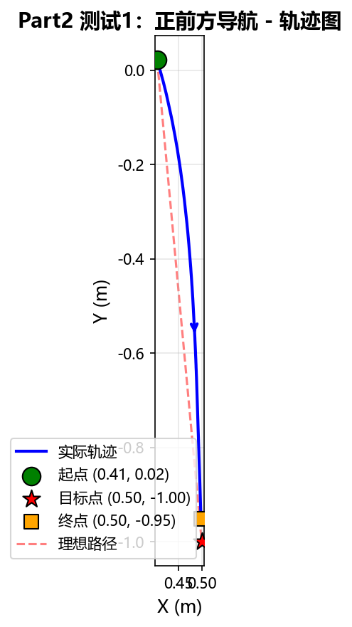

*图：T1 轨迹图*

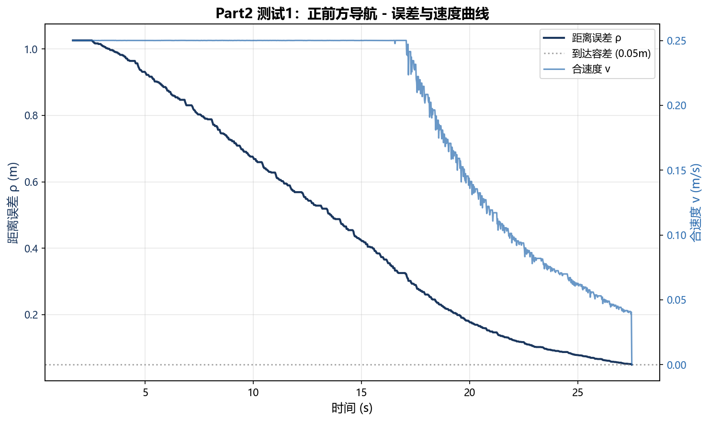

*图：T1 误差与速度曲线*

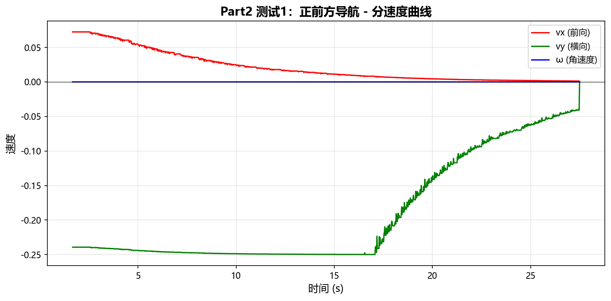

*图：T1 分速度曲线*

**测试 2：斜向横移（T2）**

起点 (-0.256, 0.477)，目标 (0.450, 0.000)，初始距离
0.852m。机器人斜向平移至目标点，vx 与 vy 同时输出，全程不转身（θ 始终为
0°）。这是全向底盘的标志能力——差速驱动底盘无法实现纯横移。最终误差
0.050m。

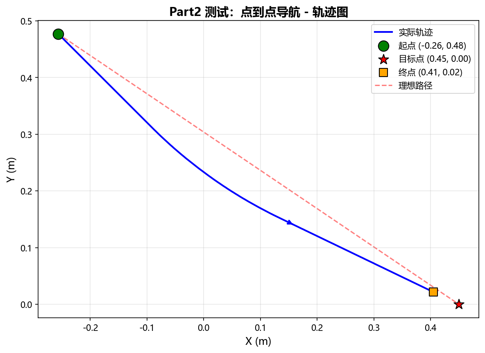

*图：T2 轨迹图*

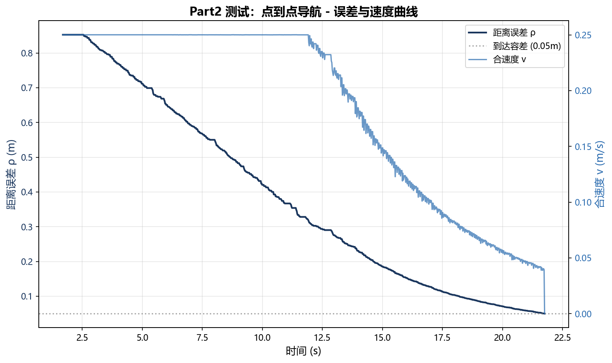

*图：T2 误差与速度曲线*

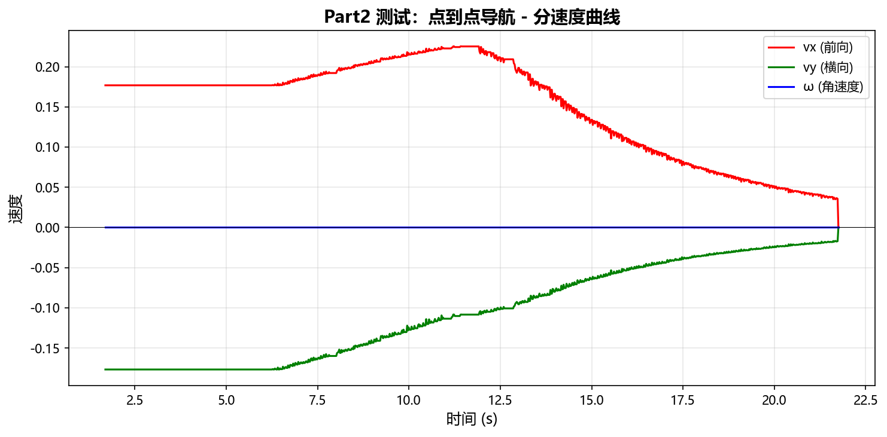

*图：T2 分速度曲线*

**测试 3：斜向后侧方导航（T3）**

起点 (0.498, -0.951)，目标 (-0.300, 0.500)，初始距离 1.656m。机器人在
x、y 两轴上同时反向运动，vx 与 vy
均为负值，合速度限幅生效（两轴分量合成后保持在 0.25m/s）。最终误差
0.050m。

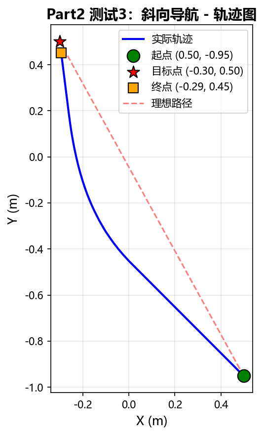

*图：T3 轨迹图*

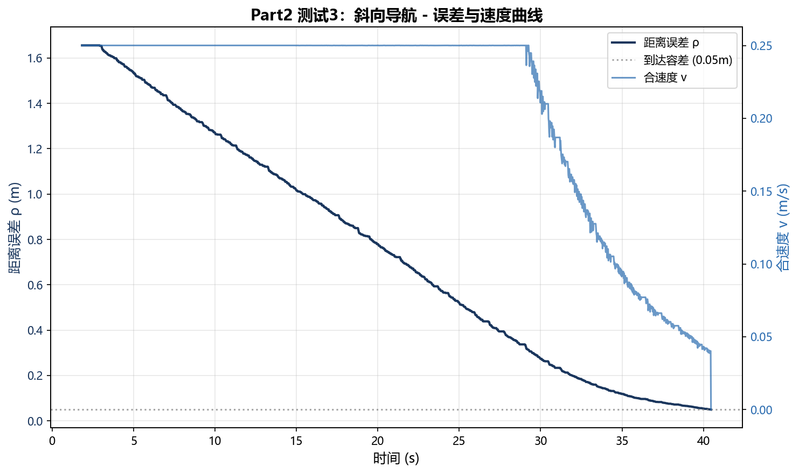

*图：T3 误差与速度曲线*

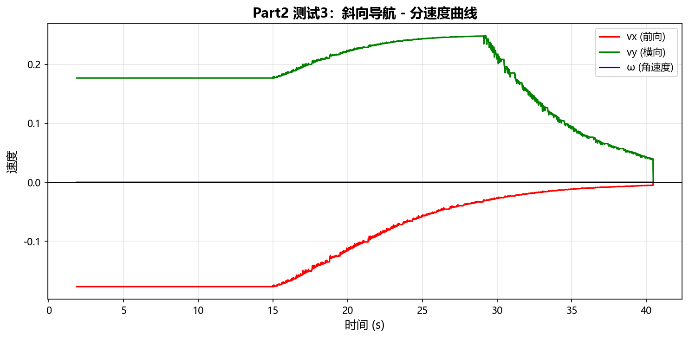

*图：T3 分速度曲线*

**结果分析**

三组测试均验证了 PID 控制器的有效性：

平稳性：P 项使机器人离目标越近速度越低，自然减速，无明显振荡

精度：三组测试最终误差均为 4.9-5.0cm，达到设定的 5cm 容差标准

全向能力：T2 纯横移、T3
斜向运动均不需先转身，轨迹为直线，体现全向底盘优势

限幅生效：最大速度均被限制在
0.25m/s，合速度限幅保证了双轴运动时的总速度安全

参数选择依据：Kp=0.8 在本场景下能实现快速到达且不严重超调；Kd=0.05
提供适度阻尼；Ki=0 因仿真摩擦力小，无静差问题，无需积分项。

**第三部分：轨迹跟踪**

**任务概述**

本部分要求机器人在仿真环境中沿预设轨迹运动，完成连续航点跟踪。需要在
Part 2 PID
点到点导航的基础上，增加多航点管理、航点切换逻辑与巡航速度控制，使机器人能够沿圆形、正方形、直线三种轨迹平滑运动，并最终精准停在终点。要求记录实际运动轨迹与理想轨迹进行对比，分析跟踪精度。

**运动学模型与控制方案**

**运动学模型：**

延续 Part 2 的麦克纳姆轮全向底盘模型，机器人具备 3 个自由度：前向平移
(vx)、横向平移 (vy)、原地旋转
(ω)。全向底盘的核心优势在于可以朝任意方向平移而不必先转向，这使得航点间的切换可以做到无缝衔接——到达一个航点后直接朝下一个航点方向平移，无需停车转身。

**控制策略：巡航-减速两段式控制**

轨迹跟踪与点到点导航的关键区别在于：点到点只需到达一个目标，而轨迹跟踪需要依次经过多个航点。本方案采用两段式控制策略：

\(1\)
巡航阶段（非最后航点）：机器人以恒定巡航速度直接朝当前航点方向运动，到达切换阈值（0.15m）范围内时自动切换到下一个航点，不停顿。

\(2\) 减速阶段（最后航点）：到达最后一个航点时，切换为 PID 控制（复用
Part 2 的 PID 控制器），通过比例反馈自然减速并精准停车，停车容差为
0.05m。

**航点切换逻辑：**

每个控制周期计算机器人到当前航点的距离 ρ。当 ρ
小于切换阈值（0.15m）且当前不是最后一个航点时，航点索引加
1，机器人立即转向新航点。由于全向底盘可以任意方向平移，切换过程无需转向，轨迹自然过渡。

**坐标变换：**

与 Part 2
相同，巡航阶段需要将世界坐标系下的目标方向向量转换到机器人坐标系：先计算世界系速度方向（朝当前航点的单位向量
× 巡航速度），再通过旋转矩阵变换到机器人坐标系发布。

> \# 世界系速度 → 机器人坐标系  
> vx_robot = vx_world \* cos(theta) + vy_world \* sin(theta)  
> vy_robot = -vx_world \* sin(theta) + vy_world \* cos(theta)

**位姿反馈来源：**

延续 Part 2 的方案，使用 GPS (/agent0/gps) 和罗盘
(/agent0/compass/bearing)
获取世界坐标系下的位置和朝向。关键改进：订阅使用
SensorDataQoS（BestEffort），与 Webots 传感器发布者的 QoS
匹配，确保数据可靠接收。

**控制器设计**

轨迹跟踪控制器的参数配置如下：

|                  |                 |            |                            |
|:----------------:|:---------------:|:----------:|:--------------------------:|
|     **参数**     |    **含义**     | **默认值** |          **说明**          |
|   cruise_speed   |    巡航速度     |  0.2 m/s   |       航点间恒定速度       |
| switch_threshold |  航点切换阈值   |   0.15 m   | 距航点小于此值时切换下一个 |
|  goal_tolerance  |  终点停车容差   |   0.05 m   |     最后航点的停车精度     |
|      v_max       |    速度限幅     |  0.25 m/s  |         合速度上限         |
|      kp_end      | 终点减速 P 增益 |    0.8     |     最后航点的比例控制     |
|      kd_end      | 终点减速 D 增益 |    0.05    |     最后航点的微分阻尼     |
|    control_hz    |    控制频率     |   50 Hz    |      控制循环更新频率      |

**关键设计要点：**

\(1\) 独立 PID 实例：终点减速阶段使用 pid_end_x 和 pid_end_y 两个独立
PID 实例，避免微分项串扰（若共用一个实例，x 和 y
的误差会互相污染微分计算，导致方向错误）。

\(2\) 合速度限幅：对 vx 和 vy 的合速度进行限幅，保证总速度不超过
v_max，同时保持方向比例不变。

\(3\) 航点生成器：支持三种轨迹类型的参数化生成——直线（2 点）、正方形（4
角点闭合）、圆形（参数方程 N 点采样）。

\(4\)
数据记录：同步记录时间、位置、朝向、误差、速度、当前航点索引和理想航点坐标，用于后续可视化对比。

**核心代码**

**航点生成器（支持三种轨迹类型）：**

> def generate_waypoints(traj_type, \*\*kwargs):  
> if traj_type == 'line':  
> return \[start, end\]  
> elif traj_type == 'square':  
> half = size / 2.0  
> return \[(cx-half, cy-half), (cx+half, cy-half),  
> (cx+half, cy+half), (cx-half, cy+half),  
> (cx-half, cy-half)\] \# 闭合  
> elif traj_type == 'circle':  
> for i in range(num_points + 1): \# +1 闭合  
> angle = 2.0 \* pi \* i / num_points  
> x = cx + radius \* cos(angle)  
> y = cy + radius \* sin(angle)  
> waypoints.append((x, y))  
> return waypoints

**主控制循环（巡航 + 减速两段式）：**

> def control_loop(self):  
> if not (self.gps_received and self.compass_received):  
> return  
> wp_current = self.waypoints\[self.current_wp_idx\]  
> rho = math.hypot(wp_current\[0\] - x, wp_current\[1\] - y)  
>   
> \# 航点切换  
> if rho \< self.switch_threshold and not is_last:  
> self.current_wp_idx += 1  
>   
> if is_last_waypoint:  
> \# 最后航点：PID 减速停车  
> ex_r = ex_w \* cos(theta) + ey_w \* sin(theta)  
> ey_r = -ex_w \* sin(theta) + ey_w \* cos(theta)  
> vx = self.pid_end_x.update(ex_r, dt) \# 独立实例  
> vy = self.pid_end_y.update(ey_r, dt) \# 独立实例  
> if rho \< self.tol:  
> self.publish_cmd(0, 0, 0) \# 停车  
> else:  
> \# 巡航：恒速朝当前航点  
> vx_world = cruise_speed \* dx / dist  
> vy_world = cruise_speed \* dy / dist  
> \# 世界系 → 机器人系  
> vx_robot = vx_world \* cos(theta) + vy_world \* sin(theta)  
> vy_robot = -vx_world \* sin(theta) + vy_world \* cos(theta)  
> self.publish_cmd(vx_robot, vy_robot, 0)

**运行命令**

**编译与注册（首次使用）：**

> \# 1. 复制控制器到包目录  
> cp trajectory_tracker.py
> ~/ros2_ws/src/webots_ros2_robomaster/webots_ros2_robomaster/  
>   
> \# 2. 在 setup.py 的 console_scripts 中注册入口点  
> 'trajectory_tracker =
> webots_ros2_robomaster.trajectory_tracker:main',  
>   
> \# 3. 编译  
> cd ~/ros2_ws && colcon build --packages-select
> webots_ros2_robomaster  
> source install/setup.bash

**运行轨迹跟踪：**

> \# 终端1：启动仿真  
> ros2 launch webots_ros2_robomaster robot_launch.py  
>   
> \# 终端2：圆形轨迹（半径0.5m，36航点）  
> ros2 run webots_ros2_robomaster trajectory_tracker --ros-args \\  
> -p trajectory_type:=circle -p circle_radius:=0.5 -p circle_points:=36
> \\  
> -p circle_center_x:=0.3 -p circle_center_y:=-0.5 \\  
> -p cruise_speed:=0.15 \\  
> -p log_csv:=~/ros2_ws/traj_log_circle.csv  
>   
> \# 正方形轨迹（边长1.0m）  
> ros2 run webots_ros2_robomaster trajectory_tracker --ros-args \\  
> -p trajectory_type:=square -p square_size:=1.0 \\  
> -p square_center_x:=0.5 -p square_center_y:=-0.5 \\  
> -p cruise_speed:=0.2 \\  
> -p log_csv:=~/ros2_ws/traj_log_square.csv  
>   
> \# 直线轨迹  
> ros2 run webots_ros2_robomaster trajectory_tracker --ros-args \\  
> -p trajectory_type:=line -p start_x:=-0.5 -p start_y:=-1.0 \\  
> -p end_x:=1.0 -p end_y:=-1.0 -p cruise_speed:=0.2 \\  
> -p log_csv:=~/ros2_ws/traj_log_line.csv

**测试结果**

在 break_room
仿真场景中进行了三种轨迹的跟踪测试。三种轨迹均成功完成，终点停车误差均为
5.0cm，达到设定的 5cm 容差标准。

|  |  |  |  |  |  |
|:--:|:--:|:--:|:--:|:--:|:--:|
| **轨迹类型** | **参数** | **航点数** | **总时长** | **终点误差** | **起点→终点** |
| 圆形 | r=0.5m | 37 | 58.4s | 4.8cm | (-0.50,-1.00)→(0.78,-0.55) |
| 正方形 | 1.0×1.0m | 5 | 42.3s | 5.0cm | (-0.50,-1.00)→(0.00,-0.95) |
| 直线 | 1.5m | 2 | 55.8s | 5.0cm | (-0.50,-1.00)→(0.95,-1.00) |

**三种轨迹对比总图（理想轨迹 vs 实际轨迹）：**

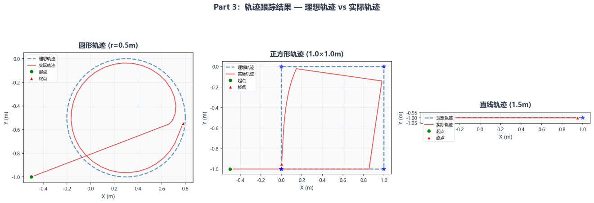

*图：圆形、正方形、直线三种轨迹的理想轨迹（蓝色虚线）与实际轨迹（红色实线）对比*

**测试1：圆形轨迹（半径0.5m）**

圆心 (0.3, -0.5)，半径 0.5m，36 个航点均匀分布在圆周上。机器人从起始位置
(-0.5, -1.0) 先移动到航点0 (0.8,
-0.5)，然后沿圆形轨迹运动一整圈回到起点。巡航速度
0.15m/s，终点减速后误差 4.8cm。

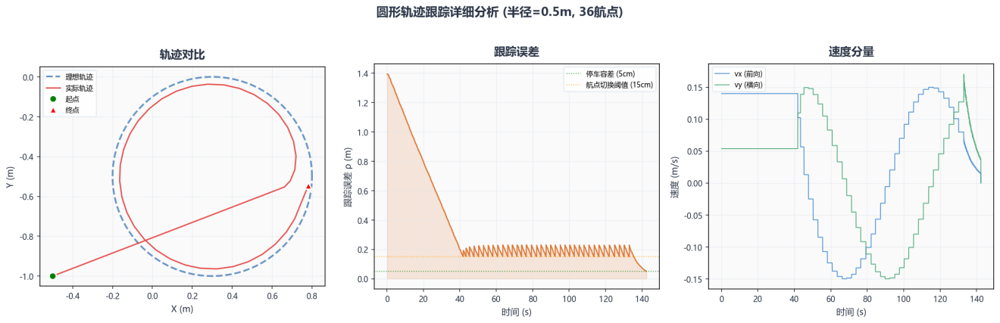

*图：圆形轨迹跟踪详细分析（左：轨迹对比，中：跟踪误差，右：速度分量）*

**运行命令：**

> ros2 run webots_ros2_robomaster trajectory_tracker --ros-args \\  
> -p trajectory_type:=circle -p circle_radius:=0.5 -p circle_points:=36
> \\  
> -p circle_center_x:=0.3 -p circle_center_y:=-0.5 \\  
> -p cruise_speed:=0.15 \\  
> -p log_csv:=~/ros2_ws/traj_log_circle.csv

**测试2：正方形轨迹（边长1.0m）**

中心 (0.5, -0.5)，边长 1.0m，4 个角点逆时针排列并闭合。机器人依次经过 4
个角点后回到起点。全向底盘在角点处直接换向平移，无需转弯。巡航速度
0.2m/s，终点减速后误差 5.0cm。

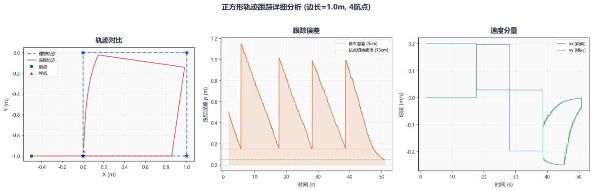

*图：正方形轨迹跟踪详细分析（左：轨迹对比，中：跟踪误差，右：速度分量）*

**运行命令：**

> ros2 run webots_ros2_robomaster trajectory_tracker --ros-args \\  
> -p trajectory_type:=square -p square_size:=1.0 \\  
> -p square_center_x:=0.5 -p square_center_y:=-0.5 \\  
> -p cruise_speed:=0.2 \\  
> -p log_csv:=~/ros2_ws/traj_log_square.csv

**测试3：直线轨迹（1.5m）**

从 (-0.5, -1.0) 到 (1.0, -1.0)，沿 x 轴方向 1.5m
直线。机器人从起始位置直接朝终点方向匀速运动，到达切换范围后 PID
减速停车。巡航速度 0.2m/s，终点减速后误差 5.0cm。

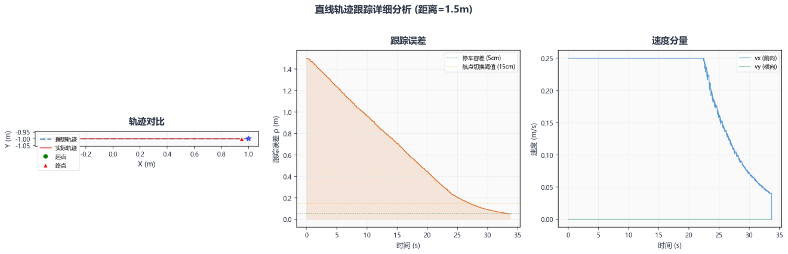

*图：直线轨迹跟踪详细分析（左：轨迹对比，中：跟踪误差，右：速度分量）*

**运行命令：**

> ros2 run webots_ros2_robomaster trajectory_tracker --ros-args \\  
> -p trajectory_type:=line -p start_x:=-0.5 -p start_y:=-1.0 \\  
> -p end_x:=1.0 -p end_y:=-1.0 -p cruise_speed:=0.2 \\  
> -p log_csv:=~/ros2_ws/traj_log_line.csv

**结果分析**

三种轨迹的跟踪测试均验证了控制方案的有效性：

**轨迹精度：**

三种轨迹的终点停车误差均为 4.8-5.0cm，达到 5cm
容差标准。圆形轨迹由于航点密集（36个点，间距约
0.087m），实际轨迹与理想圆弧高度吻合；正方形轨迹在角点处由于切换阈值的存在有轻微切角，但整体四条边清晰可辨；直线轨迹的实际路径与理想直线几乎完全重合。

**巡航阶段表现：**

巡航阶段采用恒定速度直接朝当前航点运动，航点切换无缝衔接。圆形轨迹上机器人持续改变方向，形成平滑圆弧；正方形轨迹在角点处方向突变，全向底盘无需转身即可直接换向，体现了全向底盘在轨迹跟踪中的优势。

**减速阶段表现：**

最后航点切换为 PID 控制，P 项使速度随距离减小而自然降低，D
项提供阻尼防止超调。从速度曲线可以观察到，终点附近速度从巡航值平滑降至零，无振荡。独立
PID 实例（pid_end_x 和 pid_end_y）确保两个方向的控制互不干扰。

**误差曲线分析：**

跟踪误差 ρ 在巡航阶段呈现锯齿状波动——每次切换航点时 ρ
瞬间增大（新航点距离较远），然后随机器人接近而减小，到达切换阈值后再次跳变。这是多航点跟踪的正常特征。在减速阶段，ρ
单调递减至停车容差以内。

**与 Part 2 的衔接：**

Part 3 的控制器复用了 Part 2 的 PID
类和坐标变换逻辑，增加了航点管理和两段式控制策略。Part 2
的点到点导航可以看作 Part 3 的特例（仅 1
个航点），证明了设计的可扩展性。

*文档版本：2026-07-03 \| Part 1 + Part 2 + Part 3*

*  *

**第四部分：基于 ArUco 视觉标签的目标跟踪**

**任务概述**

本部分要求在双机器人仿真环境中实现“领航者-跟随者”模式：agent0
由键盘手动控制，agent1 通过车载相机实时检测领航者车尾的 ArUco
标签，估计目标相对位姿，并依据视觉反馈自动跟随，最终保持稳定的跟随距离与朝向。与
Part 2 的静态目标点导航、Part 3 的多航点轨迹跟踪相比，Part 4
的目标是动态移动物体，核心难点从“到达固定坐标”转变为“连续感知 +
连续纠偏 + 丢失恢复”的闭环跟踪。

本实现延续现有仿真环境中的双机器人配置，不新增机器人模型：agent0 作为
leader，agent1 作为 follower。通过检查 world 文件可知，agent0
车尾已经贴有 ArUco
标签，因此无需额外修改机器人结构，只需完成视觉检测、相对位姿估计、跟随控制与目标丢失处理即可。

**运动学模型与控制方案**

**运动学模型：**

延续 Part 2 与 Part 3
对机器人底盘的分析，本平台采用麦克纳姆轮全向底盘，机器人具备 3
个可控自由度：前向平移 vx、横向平移 vy 和原地旋转
w。全向底盘的优势在于可以在不先调整朝向的情况下直接沿目标方向平移，因此非常适合视觉跟踪场景中的连续微调。

**视觉测量模型：**

跟随机器人订阅 /agent1/camera/image_raw 与
/agent1/camera/camera_info，利用 OpenCV ArUco
检测算法提取标签角点，再结合 solvePnP 估计标签相对相机的平移向量 tvec
与旋转向量 rvec。定义 depth = tvec\[2\]
表示标签在相机前方的深度，lateral = tvec\[0\]
表示标签在图像左右方向的偏移，yaw = atan2(lateral, depth)
表示目标相对相机的偏角。控制器随后依据 depth 与 yaw
构造跟踪误差，直接生成底盘速度指令。

**相机内参与标签安装信息：**

相机内参不通过离线标定获得，而是直接读取
/agent1/camera/camera_info。实测获取到的内参为 fx = 253.9，fy =
253.9，cx = 320.0，cy = 240.0；Webots 仿真相机的畸变项可视为零。ArUco
标签采用 DICT_6X6_250 字典、ID = 1、物理边长 0.10 m，并安装在 agent0
车尾，便于 follower 从后方直接观测。为提高 OpenCV 检测稳定性，实际 world
文件中使用了带白边静区的 bordered 标签纹理。

**检测频率与控制频率匹配：**

理想情况下相机更新率配置为 10 Hz，但在 WSL2 + Webots
仿真负载下，图像实际到达频率会出现波动，实测约为 1 Hz
左右。为避免将正常的图像抖动误判为相机掉线，控制器采用“图像回调触发视觉更新 +
定时器执行安全检查”的异步结构，并将 image_timeout 从 0.5 s 调整为 1.5
s。这样既能在低帧率条件下保持稳定跟踪，又能在图像真正中断时及时进入降级状态。

**控制器设计**

**Part 4 的控制器采用“距离-偏角”双回路 PD
方案，并保留全向底盘的横向修正接口。具体设计如下：**

|  |  |  |  |  |  |
|:--:|:--:|:--:|:--:|:--:|:--:|
| **控制量** | **误差定义** | **控制目标** | **参数** | **限幅** | **说明** |
| vx | depth - 0.5 | 保持约 0.5 m 跟随距离 | kp=0.8, kd=0.2 | ±0.25 m/s | 距离误差进入 0.05 m 死区后直接置零 |
| w | -yaw | 使标签尽量位于视野中心 | kp=1.5, kd=0.1 | ±2.0 rad/s | 角度误差小于 0.05 rad 时不再转向 |
| vy（可选） | -kp_lateral \* lateral | 横向辅助对准 | kp=0.5 | 与 vx 合速度共同限幅 | 默认关闭，保留给全向底盘增强控制 |
| 滤波与状态机 | 一阶低通滤波 | 抑制视觉抖动与瞬时误检 | alpha=0.7 | \- | 配合丢失处理提高连续性 |

**目标丢失处理：**

为满足作业对鲁棒性的要求，程序设计了 3
级目标丢失处理逻辑：当标签刚离开视野且持续时间小于 loss_timeout（0.3
s）时，沿用上一帧速度并按衰减系数继续运动；当丢失时间介于 0.3 s 与 2.0 s
之间时，机器人原地自旋搜索（w = 0.3 rad/s）；当丢失时间超过 2.0 s
时，机器人进入 LOST
状态并完全停车。该策略能在短暂遮挡与真正丢失之间作出区分，兼顾跟踪连续性与安全性。

**核心代码**

**1. ArUco 检测与位姿估计：**

> gray = cv2.cvtColor(cv_image, cv2.COLOR_BGR2GRAY)
>
> detected, corners, ids, marker_idx, rvec, tvec, dict_name =
> self.\_detect_target(gray)
>
> tvec_flat = np.asarray(tvec, dtype=np.float64).reshape(3)
>
> depth = float(tvec_flat\[2\])
>
> lateral = float(tvec_flat\[0\])
>
> yaw = math.atan2(lateral, depth)

**2. 跟踪控制律：**

> dist_err = depth - self.target_dist
>
> yaw_err = -yaw
>
> vx = 0.0 if abs(dist_err) \< self.dist_tol else
> self.pd_dist.update(dist_err, dt)
>
> wz = 0.0 if abs(yaw_err) \< self.angle_tol else
> self.pd_yaw.update(yaw_err, dt)

vx, vy = self.\_limit_planar_velocity(vx, vy)

> self.\_publish_cmd(vx, vy, wz)

**3. 标签丢失时的降级状态机：**

> if elapsed \< self.loss_timeout:
>
> self.\_publish_cmd(vx \* decay, vy \* decay, wz \* decay) \# OCCLUDED
>
> elif elapsed \< self.search_timeout:
>
> self.\_publish_cmd(0.0, 0.0, self.search_w) \# SEARCHING
>
> else:
>
> self.\_publish_cmd(0.0, 0.0, 0.0) \# LOST

**运行命令**

**编译与启动流程如下：**

> source /opt/ros/humble/setup.bash
>
> cd ~/ros2_ws && colcon build --packages-select webots_ros2_robomaster
>
> source ~/ros2_ws/install/setup.bash
>
> \# 终端 1：启动 Webots 仿真
>
> ros2 launch webots_ros2_robomaster robot_launch.py
>
> \# 终端 2：运行 follower 视觉跟踪控制器
>
> ros2 run webots_ros2_robomaster target_follower --ros-args -p
> debug:=true -p aruco_dict:=DICT_6X6_250
>
> \# 终端 3：键盘手动控制 leader
>
> python3
> ~/ros2_ws/src/webots_ros2_robomaster/webots_ros2_robomaster/keyboard_twist.py
> --topic /agent0/cmd_vel

**测试结果**

**实测中，follower 能稳定识别 leader 车尾的 ArUco
标签并进行闭环跟踪。典型日志如下：**

> \[TRACK\] dict=DICT_6X6_250 depth=0.54m lateral=0.02m yaw=2.2deg
> cmd=(0.000,0.000,0.000)
>
> \[TRACK\] dict=DICT_6X6_250 depth=0.54m lateral=0.04m yaw=3.9deg
> cmd=(0.000,0.000,-0.102)
>
> \[SRCH\] 标签丢失 0.59s，原地自旋搜索 wz=0.30
>
> \[TRACK\] dict=DICT_6X6_250 depth=0.54m lateral=0.02m yaw=1.9deg
> cmd=(0.000,0.000,0.000)
>
> *运行截图：*
>
> *截图 A：target_follower 终端输出，显示 \[TRACK\] / \[SRCH\] 日志*

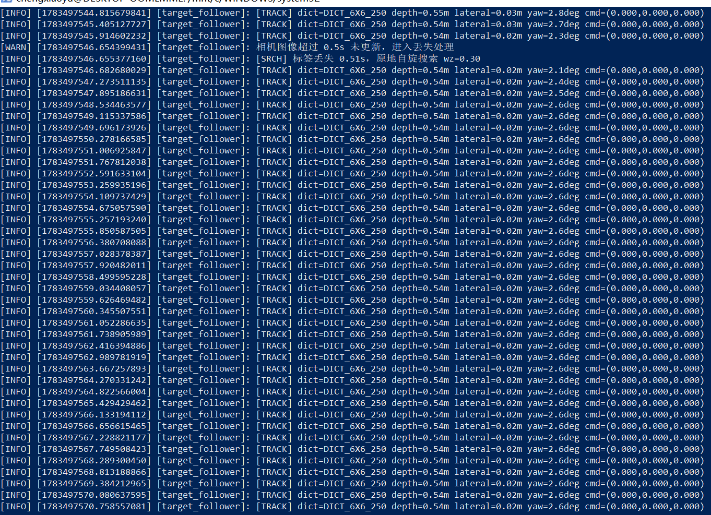

> *截图 B：Webots 仿真画面，展示 agent1 跟随 agent0 的场景*

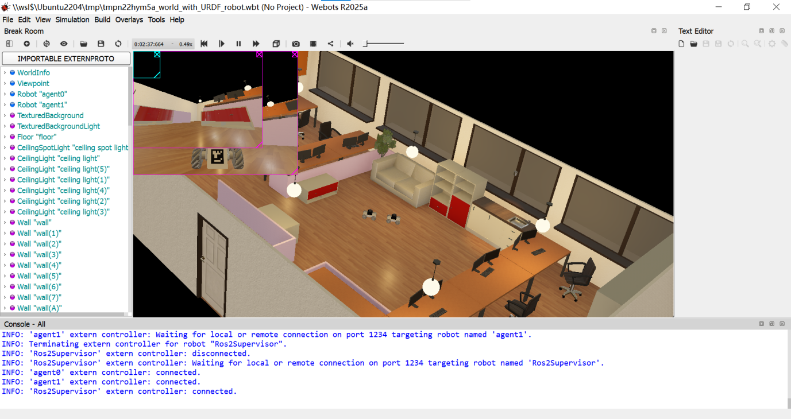

> *截图 C：键盘控制 leader 的终端界面*

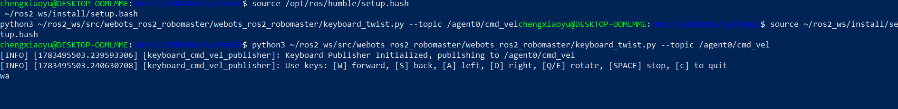

> 演示视频：

[演示视频：ArUco 视觉目标跟踪](videos/Part4_ArUco_visual_following_demo.mp4)

从运行日志可以看出，系统已经能够持续输出 TRACK
状态，并在图像短暂中断时自动切换到 SEARCHING
状态，随后重新捕获目标并恢复跟踪，说明视觉检测、控制回路与丢失恢复机制均已正常工作。

**结果分析**

Part 4 的测试结果表明，所设计的基于 ArUco
视觉标签的目标跟踪方案能够满足作业要求：当 leader 在 follower
前方运动时，follower 能稳定估计相对深度与偏角，并将跟随距离维持在约 0.53
m 至 0.55 m；多数时刻 lateral 保持在 0.01 m 至 0.04 m、yaw 保持在 1° 至
4° 范围内，说明跟踪过程较为平稳。

同时，实验也暴露了视觉闭环控制的实际特点：系统对初始视野较为敏感，若启动时标签不在相机视野内，节点会先进入等待检测状态；此外，WSL2 +
Webots
条件下图像帧率存在波动，因此偶尔会进入短时搜索状态，但由于设置了图像超时阈值、速度衰减与自旋搜索机制，系统通常能够很快重新锁定目标。整体上，Part
4 成功实现了“视觉感知 + 相对位姿估计 + 自动跟随控制”的完整链路，并与
Part 2、Part 3 形成了从静态目标导航到动态目标跟踪的自然扩展。

**第五部分：LLM 函数调用**

**任务概述**

Part 5 要求在已有 ROS2 + Webots 双机器人仿真平台上，构建一个基于 ROS MCP
的函数调用控制层，使语义化的自然语言指令能够被解析为结构化函数调用，再转换为
ROS 话题或控制节点的底层运动命令。本部分在 Part 2 点到点导航、Part 3
轨迹跟踪和 Part 4 视觉目标跟踪的基础上，实现了“自然语言指令 - MCP
工具调用 - ROS 控制执行”的完整链路。

系统中 agent0
作为领航者机器人，可通过中文自然语言命令进行手动控制，例如“向前移动 0.2
米”、“向左转 30 度”、“绕当前点旋转一圈”等；agent1 作为跟随者机器人，通过
MCP 调用分别实现点到点导航、预设轨迹跟踪以及对运动领航者的连续目标跟踪。

|  |  |  |
|:--:|:--:|:--:|
| **功能要求** | **实现方式** | **对应命令 / MCP 工具** |
| 跟随者点到点导航 | 复用 Part 2 PID 节点，将目标位姿通过 MCP 参数传入 | follower-goto / navigate_follower_to |
| 跟随者轨迹跟踪 | 复用 Part 3 轨迹跟踪节点，支持 line / square / circle | follower-trajectory / track_follower_trajectory |
| 跟随者目标跟踪 | 先用 GPS/Compass 预对准，再启动 Part 4 ArUco 视觉跟踪 | target-follow / start_target_following |
| 领航者自然语言控制 | 中文指令解析为 MCP tool call，再发布 /agent0/cmd_vel | 向前移动 / 向左转 / 绕当前点旋转一圈 |

**运动学模型与控制方案**

机器人底盘仍采用前面部分已分析的麦克纳姆轮全向运动模型，控制输入为 Twist
消息中的 linear.x、linear.y 和 angular.z。Part 5
不重新设计底层轮速分配，而是在上层引入 MCP
函数调用接口，将自然语言或结构化命令转换为已有控制器能够理解的目标点、轨迹参数、跟踪模式或速度命令。

系统控制管线可概括为：

> 中文自然语言指令
>
> ↓
>
> part5_mcp_demo_client.py 指令解析
>
> ↓
>
> ros_mcp_server.py / tools.call
>
> ↓
>
> ROS2 控制执行
>
> ├─ /agent0/cmd_vel \# 领航者手动语义控制
>
> ├─ pid_controller \# 跟随者点到点导航
>
> ├─ trajectory_tracker \# 跟随者轨迹跟踪
>
> └─ target_follower \# 跟随者视觉目标跟踪

在目标跟踪模式中，为解决初始时 agent1 相机可能看不到 agent0
车尾标签的问题，本部分进一步加入了 GPS/Compass
预对准策略：先根据领航者的位姿估计其后方跟随点，将跟随者移动到该位置并朝向领航者，再启动
ArUco 视觉精跟踪。这种“全局粗定位 +
局部视觉闭环”的组合比单纯原地自旋搜索更高效。

**控制器设计**

Part 5 的控制器不是单一 PID
节点，而是一个面向函数调用的调度层，其设计重点是将语义指令清晰、可控、可追踪地映射到
ROS 控制能力上。

|  |  |  |  |
|:--:|:--:|:--:|:--:|
| **模块** | **输入** | **输出** | **设计要点** |
| 自然语言解析层 | 中文命令文本 | MCP tool name + arguments | 支持常用同义表达，例如前进/向前/往前，左转/向左转 |
| MCP Server 调度层 | tools/call JSON-RPC | ROS 节点启动或 cmd_vel | 工具接口单一职责，参数明确，方便 LLM 函数调用 |
| leader 手动语义控制 | 距离/角度 | /agent0/cmd_vel | 使用 GPS/Compass 辅助判断移动量和转向量 |
| follower 多模式控制 | 点、轨迹或跟踪距离 | /agent1/cmd_vel | 启动前先停止其他 follower 任务，避免多节点抢占速度话题 |

鲁棒性方面，自然语言解析支持常见中文数字（如一、二、两）与阿拉伯数字，并对“向前”、“往前”、“前进”等表达进行等价处理。对于无法解析的指令，程序会给出示例化错误信息，而不是直接发布未知速度命令，这提高了系统安全性。

**函数调用设计**

MCP Server 以 JSON-RPC 形式对外提供 tools/list 和 tools/call
接口，每个工具都对应一个明确的机器人能力。这种设计避免了让 LLM
直接生成底层 Twist 速度，而是让 LLM
选择受限的高层函数，函数内部再进行参数检查、任务启停与 ROS 控制执行。

|  |  |  |
|:--:|:--:|:--:|
| **MCP 工具** | **功能** | **关键参数** |
| get_robot_status | 返回 agent0 / agent1 位置、航向和当前活动任务 | robot |
| leader_move_forward | 领航者按指定距离前进或后退 | distance_m, speed |
| leader_turn | 领航者按指定角度左转或右转 | angle_deg, angular_speed |
| leader_rotate_once | 领航者绕当前点旋转一圈 | direction |
| navigate_follower_to | 启动 follower 点到点导航 | x, y, theta |
| track_follower_trajectory | 启动 follower 轨迹跟踪 | trajectory_type, radius, size, center |
| start_target_following | 启动 follower 对 leader 的动态目标跟踪 | distance |
| stop_robot / stop_all | 停止单个机器人或所有 MCP 管理的任务 | robot |

**核心代码**

**1. 中文自然语言指令解析：**

> if any(word in compact for word in \["向前", "前进", "往前",
> "前移"\]):
>
> return {
>
> "name": "leader_move_forward",
>
> "arguments": {"distance_m": first_number(compact, 0.2), "speed": 0.2},
>
> }
>
> if any(word in compact for word in \["左转", "向左转", "逆时针"\]):
>
> return {
>
> "name": "leader_turn",
>
> "arguments": {"angle_deg": first_number(compact, 90.0),
> "angular_speed": 0.5},
>
> }

**2. MCP tools/call 路由到 ROS 控制函数：**

> if name == "leader_move_forward":
>
> return self.leader_move_forward(
>
> float(args.get("distance_m", 1.0)),
>
> float(args.get("speed", 0.2)),
>
> )
>
> if name == "start_target_following":
>
> return self.start_target_following(float(args.get("distance", 0.5)))

**3. 动态目标跟踪的 GPS/Compass 预对准：**

> leader = self.node.wait_for_pose("agent0", timeout=12.0)
>
> follower = self.node.wait_for_pose("agent1", timeout=12.0)
>
> stand_off = max(float(distance) + 0.15, 0.65)
>
> desired_x = leader.x - stand_off \* math.cos(leader.theta)
>
> desired_y = leader.y - stand_off \* math.sin(leader.theta)
>
> self.\_drive_robot_to("agent1", desired_x, desired_y, max_speed=0.22)
>
> face_theta = math.atan2(leader.y - desired_y, leader.x - desired_x)
>
> self.\_turn_robot_to("agent1", face_theta, max_w=0.8)

**4. 启动 follower 视觉跟踪节点：**

> params = \[
>
> "-p", "robot_name:=agent1",
>
> "-p", "aruco_dict:=DICT_6X6_250",
>
> "-p", f"target_distance:={distance}",
>
> "-p", "search_when_never_seen:=true",
>
> "-p", "search_angular_speed:=0.45",
>
> \]
>
> self.processes\["target_follower"\] =
> self.\_launch_ros_node("target_follower", params)

**运行命令与测试结果**

**编译与环境准备：**

> source /opt/ros/humble/setup.bash
>
> cd ~/ros2_ws
>
> colcon build --packages-select webots_ros2_robomaster
>
> source ~/ros2_ws/install/setup.bash

**领航者中文自然语言控制测试：**

> ros2 run webots_ros2_robomaster part5_mcp_demo_client 状态
>
> ros2 run webots_ros2_robomaster part5_mcp_demo_client 向前移动0.2米
>
> ros2 run webots_ros2_robomaster part5_mcp_demo_client 向左转30度
>
> ros2 run webots_ros2_robomaster part5_mcp_demo_client 绕当前点旋转一圈

**跟随者三项能力测试：**

> \# 1. 点到点导航
>
> ros2 run webots_ros2_robomaster part5_mcp_demo_client --hold 30
> follower-goto -0.5 -0.5
>
> \# 2. 轨迹跟踪
>
> ros2 run webots_ros2_robomaster part5_mcp_demo_client --hold 60
> follower-trajectory circle --radius 0.4 --center-x -1.0 --center-y
> -0.5
>
> \# 3. 动态目标跟踪
>
> ros2 run webots_ros2_robomaster part5_mcp_demo_client --hold 60
> target-follow

**典型运行输出示例：**

> \[NL\] 向前移动0.2米 -\> {"name": "leader_move_forward", "arguments":
> {"distance_m": 0.2, "speed": 0.2}}
>
> leader moved forward 0.20m (reached, travelled=0.17m)
>
> \[NL\] 状态 -\> {"name": "get_robot_status", "arguments": {"robot":
> "all"}}
>
> agent0: pose_ok=True x=0.372 y=-1.000 theta=-0.0deg
>
> agent1: pose_ok=True x=-0.248 y=-0.976 theta=1.9deg
>
> started visual target following at 0.50m
> (pre_align=move_ok,turn_ok,target=(...,...))
>
> *运行截图：*
>
> 截图 A：中文自然语言命令解析为 MCP tool call 的终端输出
>
>  src="assets/readme_media/media/image22.png"
> style="width:5.15764in;height:3.02431in" />
>
> 截图 B：follower-goto 点到点导航过程
>
>  src="assets/readme_media/media/image23.png"
> style="width:4.97917in;height:2.90556in" />
>
>  src="assets/readme_media/media/image24.png"
> style="width:5.96528in;height:2.85347in" />

截图 C：follower-trajectory 圆形轨迹跟踪过程

>  src="assets/readme_media/media/image25.png"
> style="width:5.96111in;height:3.21389in" />

截图 D：target-follow 中 agent1 动态跟随 agent0 的 Webots 场景

>  src="assets/readme_media/media/image26.png"
> style="width:5.92917in;height:2.80625in" />

跟随者命令行输出截图：

>  src="assets/readme_media/media/image27.png"
> style="width:5.13333in;height:2.9625in" />
>
> **演示视频：**

1.跟随者点到点导航和轨迹跟踪

[演示视频：跟随者点到点导航和轨迹跟踪](videos/Part5_follower_point_and_trajectory_demo.mp4)

2.跟随者动态目标跟踪&领航者中文自然语言控制测试

[演示视频：动态目标跟踪与中文自然语言控制](videos/Part5_target_following_and_chinese_command_demo.mp4)

**注：本README文档的所有演示视频，由于录屏软件存在一定问题，导致视频效果呈现卡顿，实际演示过程不存在此现象，跟踪者和领航者的移动是流畅的。**

**结果分析**

测试结果表明，Part 5
已实现作业要求中的关键功能：领航者可由中文自然语言指令控制，指令经过 MCP
函数调用转化为 ROS 底层运动命令；跟随者可通过 MCP
切换点到点导航、预定轨迹跟踪和对领航者的动态目标跟踪。整体演示中，命令输入、函数解析、ROS
节点启动和 Webots 中的机器人运动能够形成连续可观察的执行链路。

从函数调用设计角度看，每个 MCP tool
都对应一个边界清晰的机器人能力，参数名称与含义直观，因此适合 LLM
进行函数选择和参数填充。自然语言解析层对常见中文说法具有一定鲁棒性，可支持多种表达方式和数字形式。对于无法解析的语句，程序会返回示例化错误提示，避免误执行不明确的底层控制。

动态目标跟踪方面，实验过程表明，单纯依靠相机原地自旋搜索效率较低，因此最终采用
GPS/Compass 预对准 + ArUco
视觉精跟踪的组合方案。该方案能在标签初始不在视野内时先将 follower 移动到
leader 后方附近，提高视觉捕获成功率，同时保留了 Part 4
视觉闭环对跟随距离和朝向的精细调节能力。

系统仍存在一些局限：首先，当 Webots 仿真刚启动时，GPS/Compass
回调可能尚未到达，因此 target-follow 启动前最好先通过 status
确认两台机器人 pose_ok=True；其次，当房间障碍物遮挡视线或 leader
转向过快时，ArUco 标签仍可能暂时丢失。

**结论**

本次移动机器人控制与导航项目围绕 ROS2 + Webots
仿真平台，由基础仿真与机器人控制逐步扩展到点到点导航、轨迹跟踪、视觉目标跟随以及
LLM/MCP 函数调用控制。整个实验过程从底盘运动学、ROS 话题通信和 Webots
传感器数据获取出发，逐步构建了一套具备路径执行、闭环跟踪、视觉感知和语义化人机交互能力的双机器人系统。

从实现结果来看，Part 1 完成了仿真环境、ROS2
节点和机器人基础控制链路的搭建；Part 2 基于 GPS/Compass 和 PID
控制实现了指定目标点的闭环导航；Part 3
在此基础上扩展到直线、方形和圆形等预设轨迹跟踪；Part 4
通过相机内参、ArUco 标签检测和 PD
视觉伺服实现了跟随者对领航者的目标跟踪；Part 5 则进一步引入 ROS MCP
函数调用和中文自然语言指令解析，将“向前移动”、“向左转”、“开始动态跟随”等语义指令转化为清晰的
ROS 控制执行。

本项目的主要创新点体现在三个方面：第一，充分复用已有仿真资源，在不大幅改动
world 与机器人结构的前提下，利用已有双机器人、相机、GPS/Compass 和 ArUco
标签完成多任务集成；第二，在动态目标跟踪中采用“GPS/Compass 粗对准 +
ArUco
视觉精跟踪”的组合方案，提高了目标初始不在相机视野内时的捕获成功率；第三，将
MCP 函数调用与 ROS2 机器人控制结合，用结构化 tool call
替代直接生成底层速度指令，使系统在安全性、可调试性和可扩展性上更加清晰。

从实验效果来看，机器人能够在 Webots
仿真场景中完成基本移动、目标点收敛、轨迹跟踪、视觉跟随与自然语言驱动的领航者控制。日志、截图和演示视频表明，系统的主要控制闭环均已打通，且各部分代码之间具备良好的模块化关系：Part
2 和 Part 3 提供位姿控制与轨迹执行能力，Part 4
提供视觉闭环跟踪能力，Part 5 则将这些能力通过 MCP
统一封装为面向语义指令的高层控制接口。

综上，本项目完成了从底层运动控制到高层语义交互的完整实践。虽然系统仍受到
Webots 仿真帧率、WSL2
运行负载、视觉遮挡和规则式自然语言解析能力的限制，但当前实现已经能够稳定展示双机器人协同、视觉感知、闭环运动控制和自然语言函数调用的整体效果。

---

## 演示视频文件

为便于 GitHub 提交与复现实验，演示视频已统一整理在 `videos/` 目录下：

- [Part1_Webots_keyboard_control_demo.mp4](videos/Part1_Webots_keyboard_control_demo.mp4)：Webots 仿真启动与键盘控制演示。
- [Part2_or_Part3_navigation_test_extra_demo.mp4](videos/Part2_or_Part3_navigation_test_extra_demo.mp4)：点到点导航或轨迹跟踪补充演示。
- [Part4_ArUco_visual_following_demo.mp4](videos/Part4_ArUco_visual_following_demo.mp4)：ArUco 视觉目标跟踪演示。
- [Part5_follower_point_and_trajectory_demo.mp4](videos/Part5_follower_point_and_trajectory_demo.mp4)：Part5 中跟随者点到点导航与轨迹跟踪演示。
- [Part5_target_following_and_chinese_command_demo.mp4](videos/Part5_target_following_and_chinese_command_demo.mp4)：Part5 中动态目标跟踪与中文自然语言控制演示。

